# 流式输出架构设计

## 系统架构图

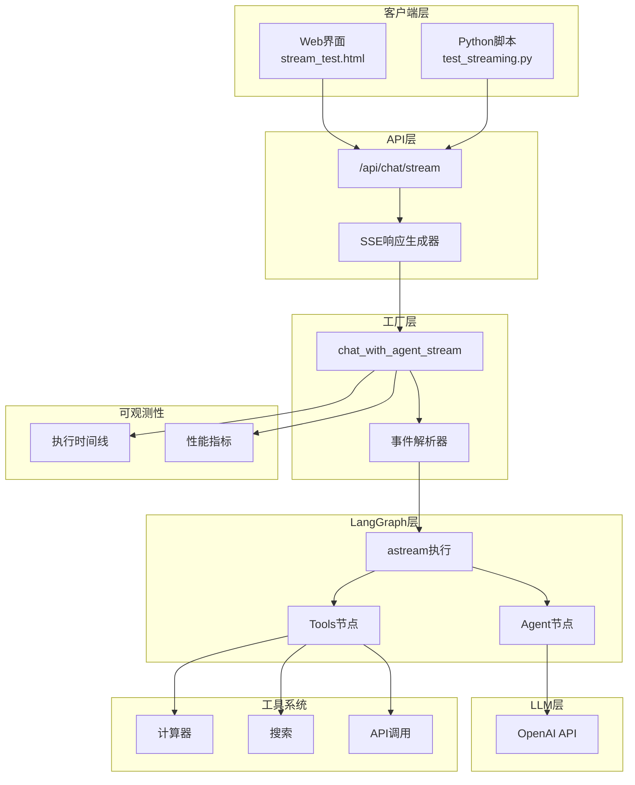
```mermaid
graph TB
    subgraph Client["客户端层"]
        UI[Web界面<br/>stream_test.html]
        Script[Python脚本<br/>test_streaming.py]
    end
    
    subgraph API["API层"]
        Endpoint["/api/chat/stream"]
        SSE[SSE响应生成器]
    end
    
    subgraph Factory["工厂层"]
        Stream[chat_with_agent_stream]
        Parser[事件解析器]
    end
    
    subgraph Graph["LangGraph层"]
        Exec[astream执行]
        Agent[Agent节点]
        Tools[Tools节点]
    end
    
    subgraph LLM["LLM层"]
        OpenAI[OpenAI API]
    end
    
    subgraph ToolSystem["工具系统"]
        Calc[计算器]
        Search[搜索]
        API_Call[API调用]
    end
    
    subgraph Obs["可观测性"]
        Timeline[执行时间线]
        Metrics[性能指标]
    end
    
    UI --> Endpoint
    Script --> Endpoint
    Endpoint --> SSE
    SSE --> Stream
    Stream --> Parser
    Parser --> Exec
    Exec --> Agent
    Exec --> Tools
    Agent --> OpenAI
    Tools --> Calc
    Tools --> Search
    Tools --> API_Call
    Stream --> Timeline
    Stream --> Metrics
```

## 数据流图

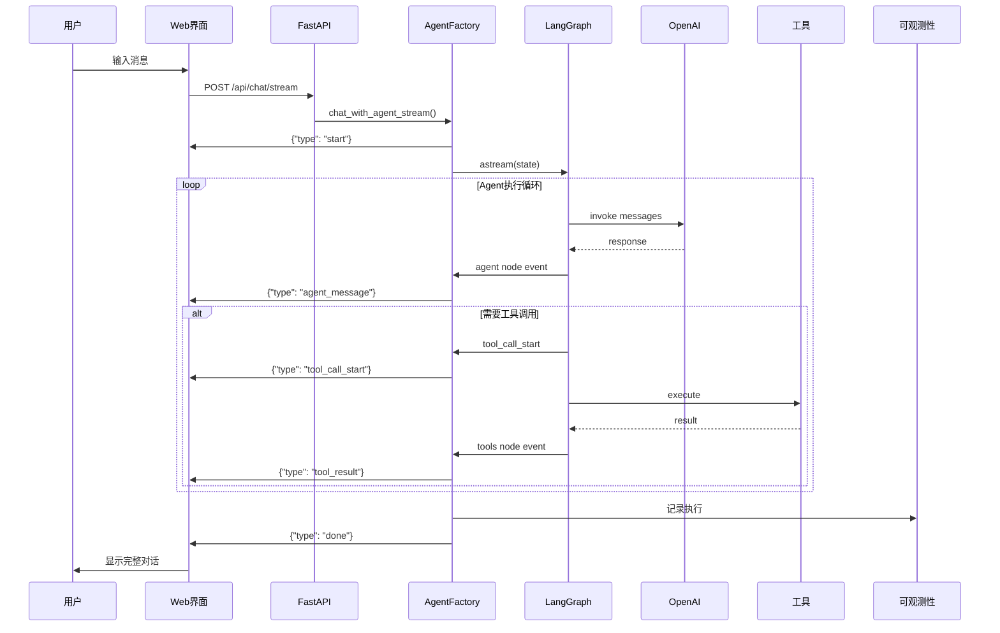
```mermaid
sequenceDiagram
    participant User as 用户
    participant Web as Web界面
    participant API as FastAPI
    participant Factory as AgentFactory
    participant LG as LangGraph
    participant LLM as OpenAI
    participant Tool as 工具
    participant Obs as 可观测性

    User->>Web: 输入消息
    Web->>API: POST /api/chat/stream
    API->>Factory: chat_with_agent_stream()
    Factory->>Web: {"type": "start"}
    
    Factory->>LG: astream(state)
    
    loop Agent执行循环
        LG->>LLM: invoke messages
        LLM-->>LG: response
        LG->>Factory: agent node event
        Factory->>Web: {"type": "agent_message"}
        
        alt 需要工具调用
            LG->>Factory: tool_call_start
            Factory->>Web: {"type": "tool_call_start"}
            LG->>Tool: execute
            Tool-->>LG: result
            LG->>Factory: tools node event
            Factory->>Web: {"type": "tool_result"}
        end
    end
    
    Factory->>Obs: 记录执行
    Factory->>Web: {"type": "done"}
    Web->>User: 显示完整对话
```

## 事件流转图

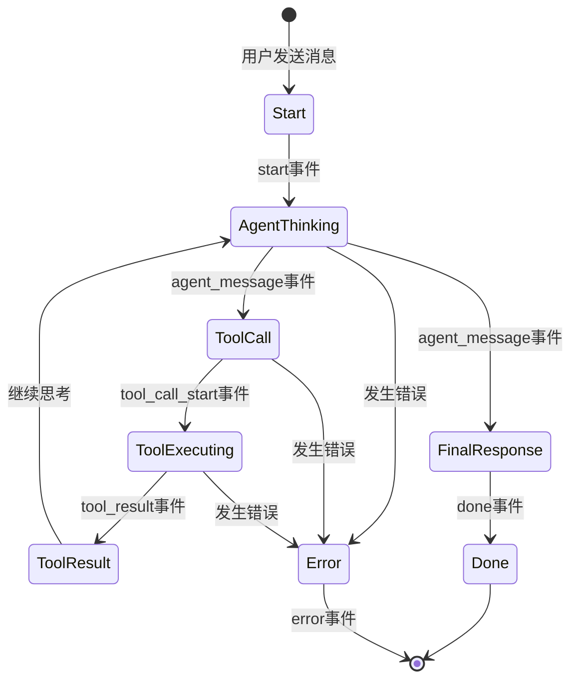
```mermaid
stateDiagram-v2
    [*] --> Start: 用户发送消息
    Start --> AgentThinking: start事件
    
    AgentThinking --> ToolCall: agent_message事件
    AgentThinking --> FinalResponse: agent_message事件
    
    ToolCall --> ToolExecuting: tool_call_start事件
    ToolExecuting --> ToolResult: tool_result事件
    ToolResult --> AgentThinking: 继续思考
    
    FinalResponse --> Done: done事件
    Done --> [*]
    
    AgentThinking --> Error: 发生错误
    ToolCall --> Error: 发生错误
    ToolExecuting --> Error: 发生错误
    Error --> [*]: error事件
```

## 组件交互图

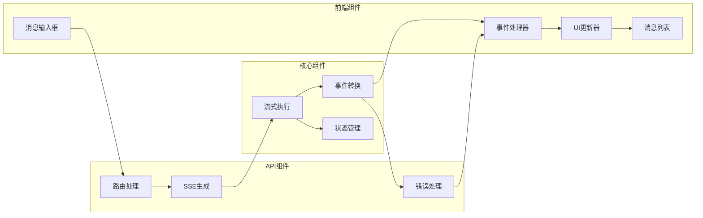
```mermaid
graph LR
    subgraph 前端组件
        A[消息输入框]
        B[消息列表]
        C[事件处理器]
        D[UI更新器]
    end
    
    subgraph API组件
        E[路由处理]
        F[SSE生成]
        G[错误处理]
    end
    
    subgraph 核心组件
        H[流式执行]
        I[事件转换]
        J[状态管理]
    end
    
    A --> E
    E --> F
    F --> H
    H --> I
    I --> C
    C --> D
    D --> B
    
    H --> J
    I --> G
    G --> C
```

## 技术栈层次

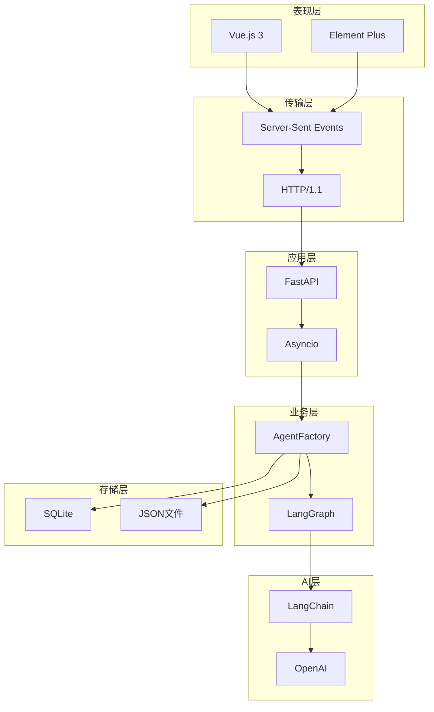
```mermaid
graph TD
    subgraph 表现层
        V[Vue.js 3]
        EP[Element Plus]
    end
    
    subgraph 传输层
        SSE[Server-Sent Events]
        HTTP[HTTP/1.1]
    end
    
    subgraph 应用层
        FA[FastAPI]
        Async[Asyncio]
    end
    
    subgraph 业务层
        AF[AgentFactory]
        LG[LangGraph]
    end
    
    subgraph AI层
        LC[LangChain]
        OAI[OpenAI]
    end
    
    subgraph 存储层
        SQLite[SQLite]
        JSON[JSON文件]
    end
    
    V --> SSE
    EP --> SSE
    SSE --> HTTP
    HTTP --> FA
    FA --> Async
    Async --> AF
    AF --> LG
    LG --> LC
    LC --> OAI
    AF --> SQLite
    AF --> JSON
```

## 事件类型关系图

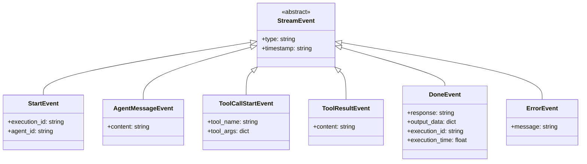
```mermaid
classDiagram
    class StreamEvent {
        <<abstract>>
        +type: string
        +timestamp: string
    }
    
    class StartEvent {
        +execution_id: string
        +agent_id: string
    }
    
    class AgentMessageEvent {
        +content: string
    }
    
    class ToolCallStartEvent {
        +tool_name: string
        +tool_args: dict
    }
    
    class ToolResultEvent {
        +content: string
    }
    
    class DoneEvent {
        +response: string
        +output_data: dict
        +execution_id: string
        +execution_time: float
    }
    
    class ErrorEvent {
        +message: string
    }
    
    StreamEvent <|-- StartEvent
    StreamEvent <|-- AgentMessageEvent
    StreamEvent <|-- ToolCallStartEvent
    StreamEvent <|-- ToolResultEvent
    StreamEvent <|-- DoneEvent
    StreamEvent <|-- ErrorEvent
```

## 并发处理模型

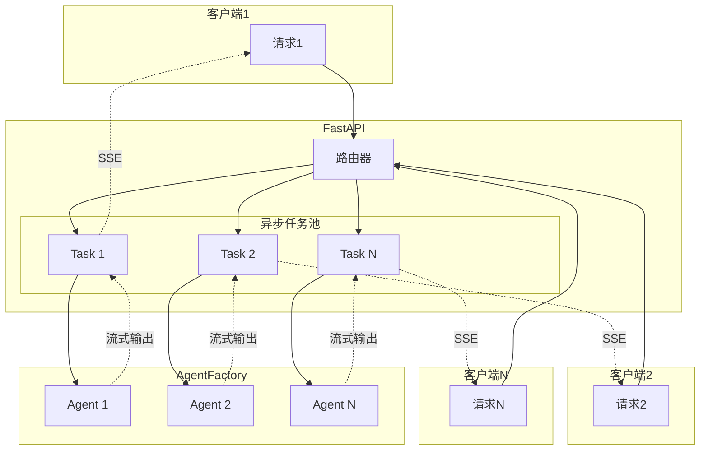
```mermaid
graph TB
    subgraph 客户端1
        C1[请求1]
    end
    
    subgraph 客户端2
        C2[请求2]
    end
    
    subgraph 客户端N
        CN[请求N]
    end
    
    subgraph FastAPI
        Router[路由器]
        subgraph 异步任务池
            T1[Task 1]
            T2[Task 2]
            TN[Task N]
        end
    end
    
    subgraph AgentFactory
        A1[Agent 1]
        A2[Agent 2]
        AN[Agent N]
    end
    
    C1 --> Router
    C2 --> Router
    CN --> Router
    
    Router --> T1
    Router --> T2
    Router --> TN
    
    T1 --> A1
    T2 --> A2
    TN --> AN
    
    A1 -.流式输出.-> T1
    A2 -.流式输出.-> T2
    AN -.流式输出.-> TN
    
    T1 -.SSE.-> C1
    T2 -.SSE.-> C2
    TN -.SSE.-> CN
```

## 错误处理流程

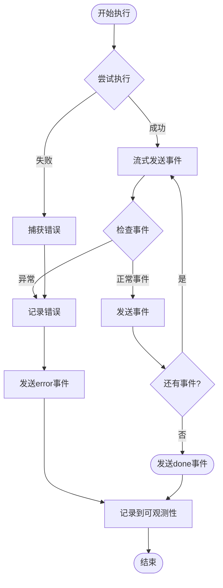
```mermaid
flowchart TD
    Start([开始执行]) --> Try{尝试执行}
    
    Try -->|成功| StreamEvents[流式发送事件]
    Try -->|失败| CatchError[捕获错误]
    
    StreamEvents --> CheckEvent{检查事件}
    CheckEvent -->|正常事件| SendEvent[发送事件]
    CheckEvent -->|异常| LogError[记录错误]
    
    SendEvent --> MoreEvents{还有事件?}
    MoreEvents -->|是| StreamEvents
    MoreEvents -->|否| Success([发送done事件])
    
    CatchError --> LogError
    LogError --> SendError[发送error事件]
    SendError --> RecordObs[记录到可观测性]
    RecordObs --> End([结束])
    
    Success --> RecordObs
```

## 性能优化策略

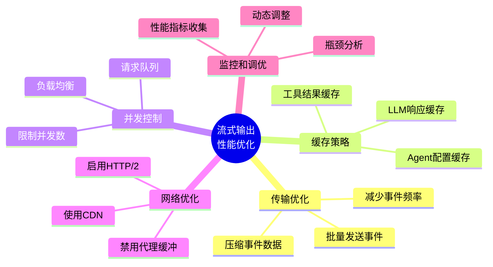
```mermaid
mindmap
    root((流式输出<br/>性能优化))
        传输优化
            压缩事件数据
            批量发送事件
            减少事件频率
        缓存策略
            Agent配置缓存
            LLM响应缓存
            工具结果缓存
        并发控制
            限制并发数
            请求队列
            负载均衡
        网络优化
            禁用代理缓冲
            启用HTTP/2
            使用CDN
        监控和调优
            性能指标收集
            瓶颈分析
            动态调整
```

## 扩展性设计

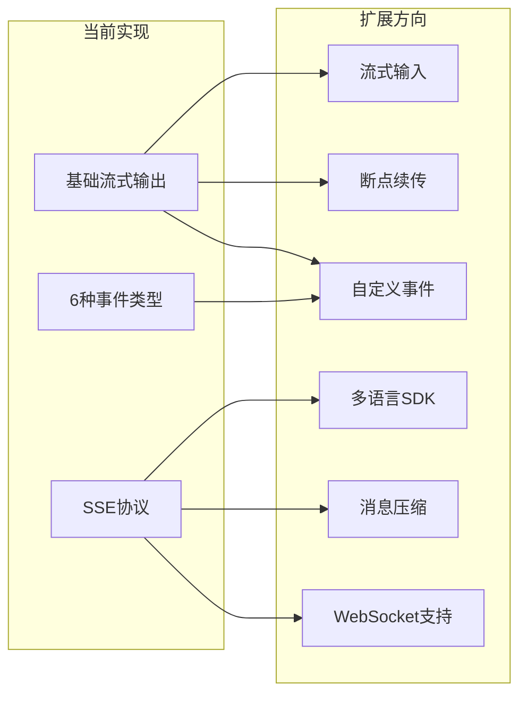
```mermaid
graph LR
    subgraph 当前实现
        A[基础流式输出]
        B[6种事件类型]
        C[SSE协议]
    end
    
    subgraph 扩展方向
        D[自定义事件]
        E[WebSocket支持]
        F[消息压缩]
        G[断点续传]
        H[多语言SDK]
        I[流式输入]
    end
    
    A --> D
    B --> D
    C --> E
    C --> F
    A --> G
    C --> H
    A --> I
```

## 安全考虑

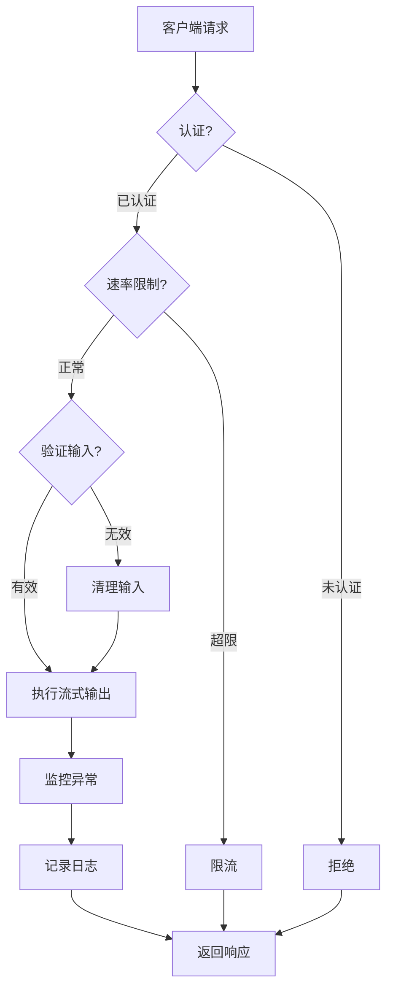
```mermaid
graph TD
    Request[客户端请求] --> Auth{认证?}
    Auth -->|未认证| Reject[拒绝]
    Auth -->|已认证| RateLimit{速率限制?}
    
    RateLimit -->|超限| Throttle[限流]
    RateLimit -->|正常| Validate{验证输入?}
    
    Validate -->|无效| Sanitize[清理输入]
    Validate -->|有效| Execute[执行流式输出]
    
    Execute --> Monitor[监控异常]
    Monitor --> Log[记录日志]
    Log --> Response[返回响应]
    
    Sanitize --> Execute
    Throttle --> Response
    Reject --> Response
```
